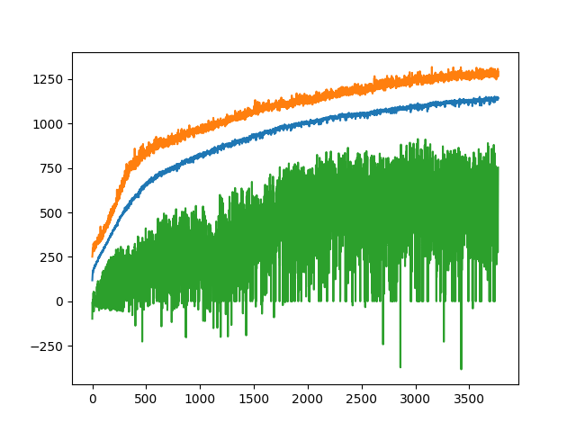

## Evo-Ant

Evolutionary Strategy applied to AntBulletEnv-v0 using [gerel](https://github.com/mauicv/gerel) [REINFORCE](https://openai.com/blog/evolution-strategies/)-[ES](https://blog.otoro.net/2017/11/12/evolving-stable-strategies/) algorithm


Solution is 2500 points over 1000 steps. Solves after around 3774 generations.



_Note_ Training is set to run 500 steps for each episode hence 1250 is target. Generation 3774 typically achieves 2500 when run for 1000 steps.

___  

### Use

To run pre-trained solution use:

```sh
python play.py
```

___

To train a solution first run `python test.py`. This run different number of batches to batch_sizes to compute the best combination on the number of processors present. It may Take a while. Will give output that looks like:

```
BATCH_SIZE=100, BATCHES=1, time: 9.764189958572388
BATCH_SIZE=50, BATCHES=2, time: 7.418277740478516
BATCH_SIZE=25, BATCHES=4, time: 7.183583974838257
BATCH_SIZE=20, BATCHES=5, time: 6.599231243133545
BATCH_SIZE=10, BATCHES=10, time: 7.606550693511963
BATCH_SIZE=5, BATCHES=20, time: 7.6629064083099365
BATCH_SIZE=2, BATCHES=50, time: 8.292027711868286
BATCH_SIZE=1, BATCHES=100, time: 9.574803113937378
```

Choose the `BATCH_SIZE` value that gets the smallest time and update it in the `train.py` file. Then run

```sh
python train.py
```

This will take a while unless you have a lot of CPUs. Training will create a file called `ant_RES_data` and save each generation as it evolves to it. You can graph training performance by running:

```sh
python graph.py
```

To run a particular generation from `ant_RES_data`, say `10` use:

```sh
python play.py --dir=ant_RES_data --generation=10
```
